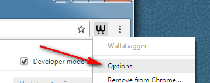

# Options

First of all: you have to create new client on your wallabag installation. How to do that is described in [Documentation](https://doc.wallabag.org/developer/api/oauth/#creating-a-new-api-client)
What we need from that client is two strings: Client ID and Client secret:

## Access options page

After installation of wallabagger extension you can setup it by options page. This page is accessible by

* Right click on extension icon and choose menu "options"

    

* Go to your chrome-based browser [extension setup page](chrome://extensions), and click on "options" in wallabagger section

    

## Setup process

* Enter URL of your wallabag installation (without "http://" ), check "https" if you use that, and click "Check URL" button

    

    if URL is valid then in checklist in the bottom of page will be information about that.

    

* If URL was checked and api version is > 2 then appears client and user information fields. Fill it and click "Get token" button. In future access token will get authomatically, when it expires.

    

    if information is correct in checklist will be information about that.

    

* If you are to have tags consisting space in its, check appropriate options. This change fix symbol in tag input from Space to Enter

    

## Security warning

In this version of extension your password is stored in browser local storage in plain text and can be retrieved by abuser. Password encryption will be implemented in future versions.
